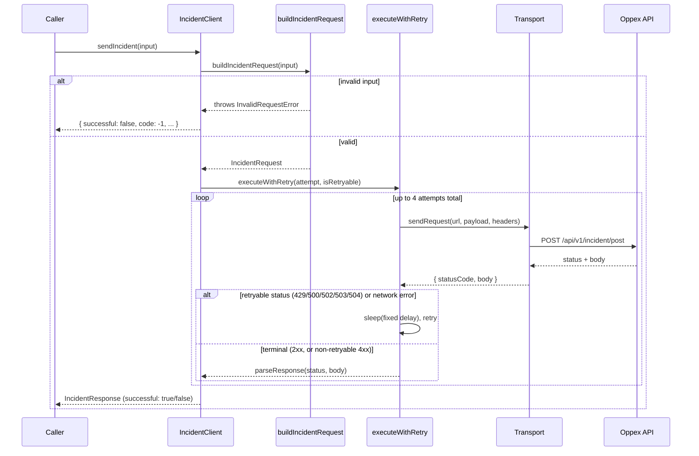

# Node SDK Architecture

This document explains how a call actually flows through the SDK at runtime — the
pieces involved, in what order, and why each one exists. For *why the codebase is
structured the way it is* (two variants, one branch, build/release tooling, documented
divergences from the Java SDK), see [`../CLAUDE.md`](../CLAUDE.md). This doc is the
complement to that one: runtime architecture, not project structure.

## The one-sentence version

`IncidentClient` validates a request, serializes it, sends it with retries through a
Node-version-appropriate transport, and turns every possible failure — invalid input,
network error, non-2xx response, a bug — into a normal, non-throwing return value. It
never throws or rejects from its two public send methods, by design.

## Component map

```text
IncidentClient                         (façade — the only class consumers touch)
 ├─ buildIncidentRequest()             (model/IncidentRequest.ts — validate + normalize)
 ├─ AsyncDispatcher                    (internal/async — bounds fire-and-forget work)
 │   └─ RateLimitedDropLogger          (internal/async — one log line per overload, not one per drop)
 ├─ executeWithRetry()                 (internal/retry/RetryExecutor.ts — the retry loop)
 ├─ Transport (legacy or modern)       (internal/transport.ts — the actual HTTP call)
 ├─ isRetryableStatus()                (internal/http/retryableStatus.ts — status → retry decision)
 └─ serializeRequest() / parseResponse() (internal/wire/wireCodec.ts — wire format)
```

Everything under `internal/` is exactly that — internal. `index.ts` exports only
`IncidentClient`, `Severity`, and the public input/output types
(`IncidentRequestInput`, `IncidentResponse`). Nothing else is part of the supported
surface, even if it's technically reachable by a deep import.

## Request flow: `sendIncident`



Every branch in that diagram — invalid input, retries exhausting, a non-retryable
4xx, an unexpected internal error — lands back at the caller as a normal
`IncidentResponse`, never a thrown exception or a rejected promise. That's the whole
point of the design: `sendIncident` is safe to `await` from inside a `catch` block that
is already handling some other failure.

`sendIncidentAsync` runs the identical `buildIncidentRequest` → `deliver` path, but
wrapped in `AsyncDispatcher.submit()` instead of being awaited directly — see below.

## Key components

### `IncidentClient` (`src/IncidentClient.ts`)

The façade, and the only class a consumer instantiates. Holds three pieces of
per-instance state:

- `apiKey`/`serviceKey`/`tenant` — validated once, synchronously, in the constructor.
  This is the **one** place the SDK still throws — the "never throws" guarantee is
  scoped to `sendIncident`/`sendIncidentAsync`, not to misusing the constructor.
- `dispatcher` — a private `AsyncDispatcher()`, used only by `sendIncidentAsync`.
- `transport` — a private, per-instance transport (see below). Each `IncidentClient`
  owns its own transport instance specifically so that one client's `close()` can
  never affect a different, still-active client's in-flight sockets.

`sendIncident` and `sendIncidentAsync` both funnel through the same private
`deliver()` method, which does three things: attach the client's `serviceKey`/`tenant`
defaults (a per-call `request.serviceKey`/`tenant` can override them), serialize the
payload, and run the actual HTTP attempt through `executeWithRetry`. Every failure
mode `deliver()` can produce — a network error, a retryable status that exhausted
retries, a non-retryable status — is represented as a plain `DeliveryFailure` object
(`{ retryable, code, message }`) thrown internally and caught at the boundary, never
allowed to escape as an actual `Error` subclass a consumer would need to know about.

### `buildIncidentRequest` (`src/model/IncidentRequest.ts`)

Validates and normalizes a raw `IncidentRequestInput` into a wire-ready
`IncidentRequest`, or throws `InvalidRequestError` (internal-only — caught by
`IncidentClient`, never seen by a consumer). Checks: non-blank `title`/`source`,
`source` ≤ 255 chars, `severity` in 1–5, `priority` in 1–5 (defaults to 1),
`srcTimestamp` > 0 (defaults to `Date.now()`). Both numeric checks use
`Number.isFinite()` rather than a plain range comparison — `NaN < 1` and `NaN > 5` are
both `false`, so a naive range check would silently accept `NaN` as valid and let it
serialize to `null` on the wire with no error ever surfaced.

### `wireCodec` (`src/internal/wire/wireCodec.ts`)

Two pure functions, no I/O:

- `serializeRequest` — builds the JSON payload with a **fixed key order**
  (`serviceKey, title, source, severity, priority, srcTimestamp, tenant, component,
  group, type, detailsJSON`), omitting any unset optional field entirely rather than
  sending it as `null`.
- `parseResponse` — turns an HTTP status + body into an `IncidentResponse`. If the body
  isn't valid JSON (e.g. a proxy or WAF returned an HTML error page), it falls back to
  a generic `"Received a non-JSON response (status N)"` message — deliberately never
  including any of the raw body, even truncated, since that raw text could echo back
  request headers (including `X-API-KEY`) into the host application's own logs.

### `executeWithRetry` (`src/internal/retry/RetryExecutor.ts`)

A pure retry loop with zero Node API surface (it takes `sleep` as an injectable
parameter, which is how it's unit-tested without real timers). Fixed policy, not
public configuration: 3 retries (4 attempts total), fixed delays `[500, 1000,
2000]`ms, no jitter, no `maxRetries`/`timeoutMs` knobs exposed anywhere. A caller
supplies an `isRetryable(err)` predicate; a non-retryable failure throws immediately
on the first attempt. Individual retry attempts are never logged — only the final
failure, and only when it's a network-level failure (`code: -1`, meaning no real HTTP
response was ever received), gets a `"(after N attempts)"` suffix appended to its
message. A failure that came from a real HTTP status keeps its original message
unchanged even after exhausting retries — the status code already says what happened.

### `Transport` (`src/internal/transport.legacy.ts` / `transport.modern.ts`)

The one piece of real logic that differs between the two npm packages — see
[`../CLAUDE.md`](../CLAUDE.md) §2 for the full two-variant build story. Both variants
implement the same tiny interface:

```ts
interface Transport {
  sendRequest(url: string, payload: string, headers: Record<string, string>): Promise<{ statusCode: number; body: string }>;
  closeTransport(): void;
}
```

- **legacy** (`@oppex/integration-sdk-legacy`, Node ≥8): core `http`/`https`, a private
  keep-alive `Agent` per transport instance (`maxSockets: 20`), manual timeout via
  `req.setTimeout()` + `req.destroy()` — no `AbortController`, which isn't reliably
  global until Node 15.
- **modern** (`@oppex/integration-sdk`, Node ≥18): global `fetch` only, timeout via
  `AbortSignal.timeout()`. `closeTransport()` is a no-op — `fetch`/undici exposes no
  dependency-free way to close a connection pool.

`IncidentClient` calls `createTransport()` once per instance — never a shared,
module-level singleton — specifically so `close()` on one client can't destroy sockets
a different, still-active client is using.

### `AsyncDispatcher` (`src/internal/async/AsyncDispatcher.ts`)

Backs `sendIncidentAsync` only — `sendIncident` never touches it. Bounds fire-and-forget
work to at most `MAX_CONCURRENCY` (2) requests in flight at once, queuing the rest up to
`QUEUE_CAPACITY` (5000) and dropping the *oldest* queued task once full — a deliberate,
bounded-loss tradeoff rather than unbounded memory growth under sustained overload.

The queue is a plain array with a `queueHead` index rather than using
`Array.prototype.shift()` — dequeuing and drop-oldest eviction are both O(1); the array
is compacted only once its dead prefix grows past capacity, or reset outright once
fully drained, so the amortized cost per dequeue stays O(1) even under heavy load. (See
the earlier explanation above for the full before/after.)

`RateLimitedDropLogger` sits behind the drop-oldest path: it accumulates a count and
emits at most one `"Dropped N incidents in the last minute."` line per interval (60s),
rather than one log line per dropped incident — the difference between one line and a
log-flooding incident during a real overload.

### Shutdown: `close()`

`IncidentClient.close()` is idempotent. It stops accepting new work, lets
`AsyncDispatcher` keep draining whatever's already in flight or queued up to
`CLOSE_DRAIN_TIMEOUT_MS` (10s), force-drops whatever's still left after that, then
closes the transport. That 10s figure is a deliberate tradeoff sized to fit inside
Docker's default 10s container stop grace period (with headroom under Kubernetes'
default 30s) — not a number to raise "for safety," since the orchestrator SIGKILLs the
process at its own grace-period boundary regardless of what this SDK does. Calling
`close()` is optional: if nothing ever calls it, whatever's in flight is simply
dropped on process exit, the same default behavior as any other unflushed in-memory
client. See [`../CLAUDE.md`](../CLAUDE.md) §9 for the full reasoning.

## Design invariants worth remembering

- **Never throws, never rejects** — `sendIncident`/`sendIncidentAsync` only. Every
  failure mode becomes a normal `IncidentResponse` (`successful: false`) or, for the
  async path, a log line plus an optional `onError` callback invocation.
- **No shared mutable state across `IncidentClient` instances** — no module-level
  transport pool, no global dispatcher. Two clients in the same process are fully
  independent; closing one never affects the other.
- **Retry policy is fixed, not configurable** — every caller gets the same predictable
  behavior; there is no `maxRetries`/`timeoutMs` constructor option to accidentally
  misconfigure.
- **Nothing internal is ever thrown across the public boundary** —
  `InvalidRequestError`/`ClientClosedError` shape log messages and response `message`
  fields only; a consumer never needs an `instanceof` check against anything this SDK
  exports.
